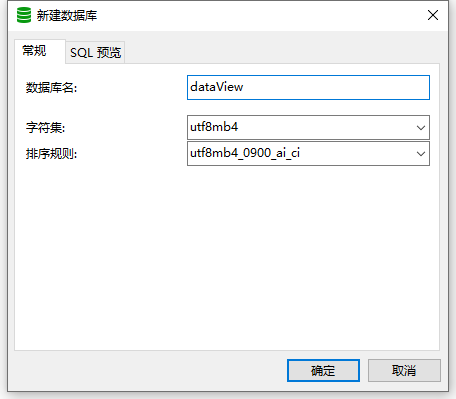
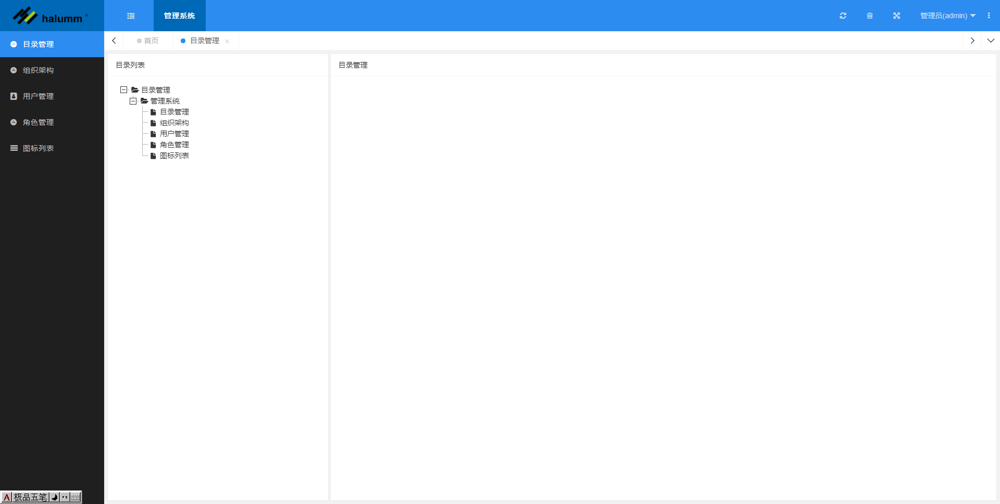

后台模板
===============
# 安装步骤
1、依赖包安装：记录在packages.text

2、数据库配置(mysql)：

打开目录appView->settings.py，修改数据库配置

    DATABASES = {
        'default': {
            'ENGINE': 'django.db.backends.mysql',
            'NAME': 'dataView',             # 数据库名，先前创建的
            'HOST': '192.168.0.123',        # mysql服务所在的主机ip
            'PORT': 3306,                   # mysql服务端口
            'USER': 'root',
            'PASSWORD': '密码',
        }
    }
数据库初始化：

python manage.py makemigrations

python manage.py migrate

python manage.py loaddata initData.json      # 导入数据

默认管理员账号:admin

密码：m1

3、登录后台成功界面：

# 主要特性
